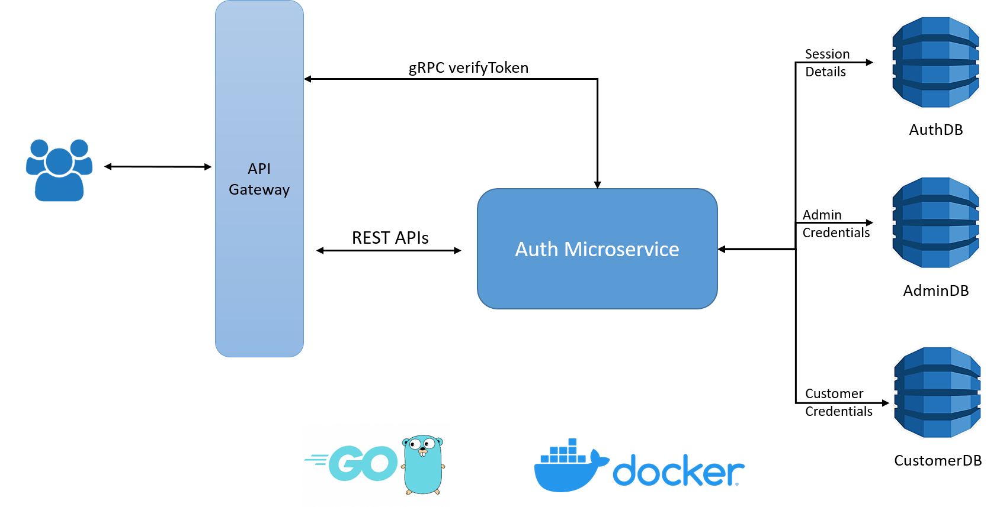
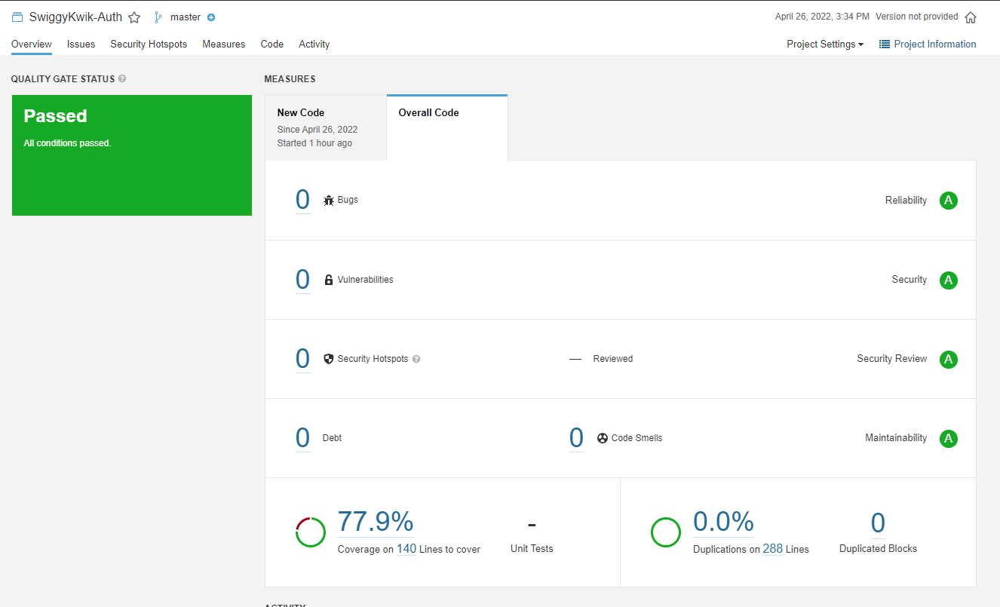

# Auth Service

# Responsibilities
 - Login Admin & Customer users.
 - Maintain logged-in sessions. Multiple sessions supported for each user.
 - Logout users.
 - Verify all user requests.

# REST endpoints exposed
 - GET /api/auth
   * Health Check
 - POST /api/auth/login
   * User Login
 - POST /api/auth/logout
   * User Logout
 - POST /api/auth/verify
   * Request Verification

# Steps to run application
- Run using startup file  `startup.sh` or `startup.bat`

- Using docker-compose
    `docker-compose up --build -d`

- Run locally
    1) `cd auth`
    2) `go build -o authService.exe`
    3) `./authService.exe`

# Features Implemented
 - HealthCheck API
 - Swagger documentation - http://localhost:8081/api/swagger/index.html
 - Dockerized the application
 - Implemented REST endpoints using DynamoDB
 - Unit tests for domain layer & REST handlers using mockery and testify
 - Sonarqube to calculate code coverage
 - GRPC service methods to for inter microservice communication
 - Reduced docker image size from 1GB to 50 MB using multi-stage build
 - Setup CI/CD pipeline with Jenkins on EC2 instance

# Architecture

# Sonarqube Report

