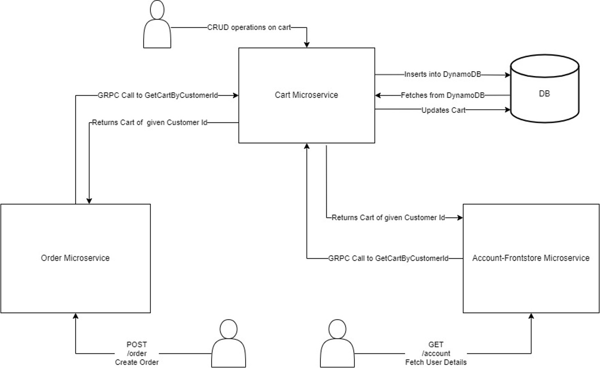

# Cart service

# Responsibilities
1) Allows user to create, read, update and delete their cart from frontstore
2) Allows user to update cart items and their quantity
3) Allows user to delete cart items

# Features implemented
- [x] Dockerized the service
- [x] Swagger Documentation
- [x] Effective Use of GRPC for inter-service communication.
- [x] Sonarqube to calculate code coverage.
- [x] Implemented REST endpoints using DynamoDB
- [x] Maintained the code repository
- [x] Built the services using CI/CD pipeline
- [x] Data models properly showcased
- [x] Mock Testing using mockgen and testify
- [x] Logging in a separate file
- [x] HealthCheck API

# Technologies Used
- Golang
- Gin Gonic
- gRPC
- DynamoDB
- Docker & Docker Compose
- Jenkins
- Swagger UI

# REST endpoints exposed
1) [POST] - CreateOrder - http://localhost:7000/api/order
2) [POST] - CreateInvoice - http://localhost:7000/api/orders/invoice/:id
3) [GET] - GetAllOrders - http://localhost:7000/api/orders
4) [GET] - GetOrderByStatus- http://localhost:7000/api/orders/status/:status
5) [GET] - GetOrderById - http://localhost:7000/api/orders/:id
6) [GET] - GetOrderByCustomerId - http://localhost:7000/api/orders/users/:id
7) [PUT] - UpdateOrder - http://localhost:7000/api/orders/:id
8) [DELETE] - DeleteOrderById- http://localhost:7000/api/orders/:id
9) [GET] - HealthCheck - http://localhost:7000/api/

# Architecture

# Steps to run application
1) Using docker
   1) 
      `docker build --tag cart -t cart .`
   2) `docker run -d -p 5000:5000 cart ` 

2) Run locally
   1) `cd cart` 
   2) `go run .`
