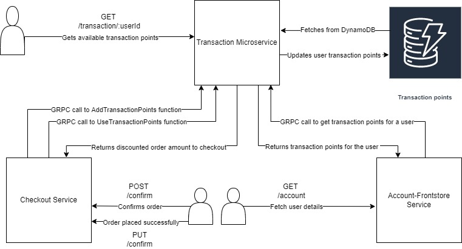
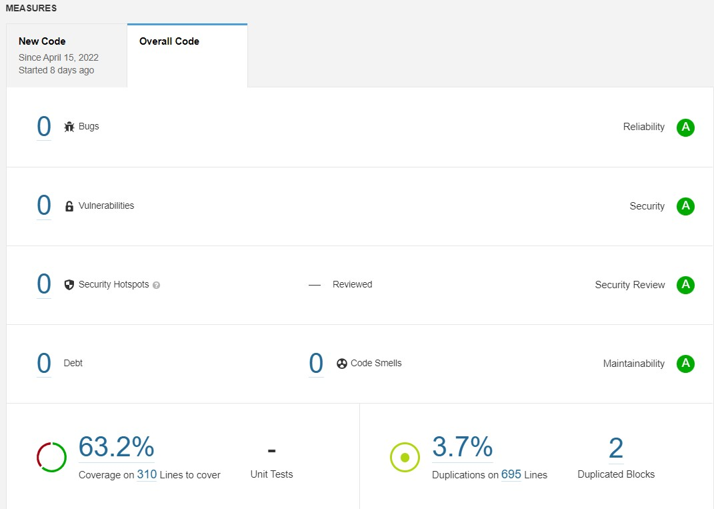
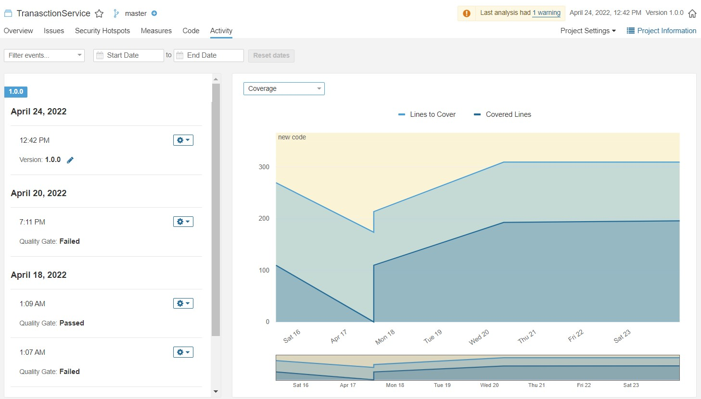

# Transaction Service

# Responsibilities
1) To add transaction points on every successful order made by the user.
2) To get transaction points by user id.
3) To reduce order amount, if the user wishes to use his available transaction points.

# REST endpoints exposed
1) [POST] - AddTransactionPoints - http://localhost:9001/transaction/:userId
2) [GET] -  GetTransactionPoints - http://localhost:9001/transaction/:userId
3) [POST] - UseTransactionPoints - http://localhost:9001/transaction/use-transaction-points/:userId
4) [GET] -  HealthCheckAPi       - http://localhost:9001/transaction/health

# Steps to run application
1) Using docker
    1)
    `docker build --tag transaction -t transaction .`
    2) `docker run -d -p 9001:9001 transaction `

2) Using docker-compose
    `docker-compose up --build -d`

3) Run locally
    1) `cd transaction`
    2) `go build`
    3) `./transaction`

# Features Implemented
1) HealthCheck API
2) Swagger documentation - http://localhost:9001/api/swagger/index.html
3) Dockerized the application
4) Implemented REST endpoints using DynamoDB.
5) Unit tests for controller layer and service layer using gomock and testify
6) Sonarqube to calculate code coverage.
7) GRPC service methods to for inter microservice communication
8) Reduced docker image size from 1GB to 50 MB using multi-stage build.

# Architecture

# Sonarqube Reports

